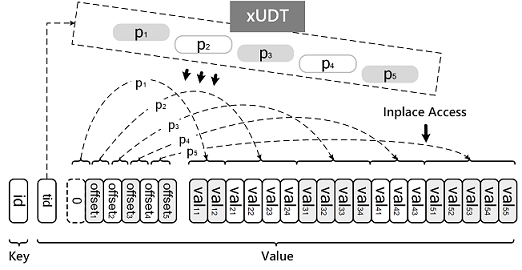

Stylus: A Strongly-Typed Store for Serving Massive RDF Data
===========================================================

Stylus is a strongly-typed store for serving massive RDF data. It is built on top of a distributed in-memory key-value store. The most distinguishing characteristics of Stylus is its strongly-typed storage scheme for modeling RDF entities. 

## Design Philosophy
Stylus is built on top of a distributed in-memory key-value store that **1)** supports *in-place* data access to the selected parts of a data record, instead of serializing or deserializing the whole KV pair; **2)** supports *message passing* between distributed servers.

#### Why a Distributed In-memory Infrastructure

An efficient distributed in-memory key-value store is an essential part of Stylus. On the one hand, efficient parallel processing of large graphs requires an efficient storage infrastructure that supports fast random data
access of the graph data [1] and the main memory (RAM) is still the most viable approach to fast random access. On the other hand, the ever growing size of knowledge requires scalable solutions and distributed systems built using commodity servers are usually more economical and easier to maintain compared with scale-up approaches. Particularly, we build our RDF store on top of [Microsoft Trinity Graph Engine](https://www.graphengine.io/), which well meet the requirements discussed above.

#### Why a Strongly-Typed Storage Scheme

The benefits of the strongly typed storage scheme are providing **1)** a compact storage,  **2)** fast random data accesses, and **3)** reduced joins for query processing.

#### More Details

- Multi-valued properties as first-citizens
- A unified record for each entity instead of entity segments that require additional joins for data aggregation
- Data-aware storage scheme to minimize the storage cost

## System Architecture 

Stylus compacts the storage by replacing [RDF literals](https://www.w3.org/TR/rdf11-concepts/#section-Graph-Literal), which are used for values such as strings, numbers, and dates, by their integer IDs. Stylus keeps a literal-to-id mapping table that translates literals of a SPARQL query into ids during query processing and maps the ids back to literals before returning results.

Most importantly, Stylus always models an RDF data set as a strongly-typed directed graph. Each node in the graph represents a unique entity using a record with several data fields. A graph node corresponds to either an subject or an object of the RDF data set. The storage scheme adopted by Stylus is given as follows: Given an RDF data set, Stylus will scan the data, extract metadata, and build a data schema for the data set. The generated schema contains all the strongly-typed data types needed for describing the data set. Stylus then stores each entity in a single record for fast data access according to the data schema.

Stylus is distributed SPARQL query processing engine on top of the strongly-typed storage scheme given above. The overall architecture of Stylus is shown in the figure. 

The whole RDF graph is partitioned over a cluster of the servers using random hashing. Each server has duplicated graph schema, but the data partitions are disjoint. A user submits a query to the query coordinator. The coordinator generates a query plan based on prepared statistics and indices and distributes the query plan to all servers. Then, each server executes the query plan and send back the partial query results to the coordinator. On receiving all partial results, the coordinator aggregates them and return the final result to the user.

#### Introduction to xUDT and xTwig

As most graph processing tasks are IO-intensive and Stylus uses RAM as its main storage, designing a compact and efficient storage scheme becomes one of the core problems.

The most important concept in our strongly-typed system is the user-defined types (UDTs), each of which is a fixed-collection of predicates. We designed a tailored UDT, named xUDT, for modeling RDF entities. An xUDT is defined as `(tid, <p1, p2, ..., pn>)` and the instance of of an xUDT `tid` is stored as `(id, <tid, offsets, obj_vals>)`. Here is an illustration for an xUDT and its instance:

The key data structure we designed for compact representation of the intermediate results is xTwig.

## Stylus Usage Manual

#### Dependencies

- Platform `.Net 4.5`
- Graph Engine >= 1.0.8482
- dotNetRDF >= 1.0.12

#### RDF Data Preparing & Loading

> Currently, Stylus console only handles RDF data sets in NTriples format (support for other formats is coming soon).

Switch to the location of Stylus executable console (compiled from `src/Stylus/Stylus.Tools.sln`), and run `Stylus.Console.exe`. Then execute these commands to prepare the data:

- `prepare <nt_filename> [<path_to_paired_nt_file>]`: pair the RDF triples
- `scan <path_to_paired_nt_file>`: generate the xUDT information
- `assign <path_to_paired_nt_file>`: generate the id-literal mapping
- `encode <path_to_paired_nt_file> [<path_to_encoded_file>]`: encode the file (optional) 

- Data loading:
  - Single-machine mode: load the raw file to the storage by `load <path_to_paired_nt_file>` or `loadx <path_to_encoded_file>`
  - Distributed mode: run each server by `start -server` and the proxy by `start -proxy`. After the cluster starts up, run the command on the proxy to load the data in parallel: `dload <path_to_paired_nt_file>` for the raw paired file or `dloadx <path_to_encoded_file>` for the encoded paired file

#### SPARQL Query Executing

- Single-machine mode

  Reload the storage image from disk by `repo`, and query the storage by `query <path_to_sparql_query_file> [fix]`

- Distributed Mode

  Reload the storage image from disk by `drepo`, and query the storage by `dquery <path_to_sparql_query_file> [fix]`. 

The optional `fix` is set up for fixing the issue of changing the original URI by the dotNetRDF SPARQL parser (for example, for LUBM data sets)

#

[1] A. Lumsdaine, D. Gregor, B. Hendrickson, and J. Berry. **Challenges in parallel graph processing.** Parallel Processing Letters, 17(01), 2007.

